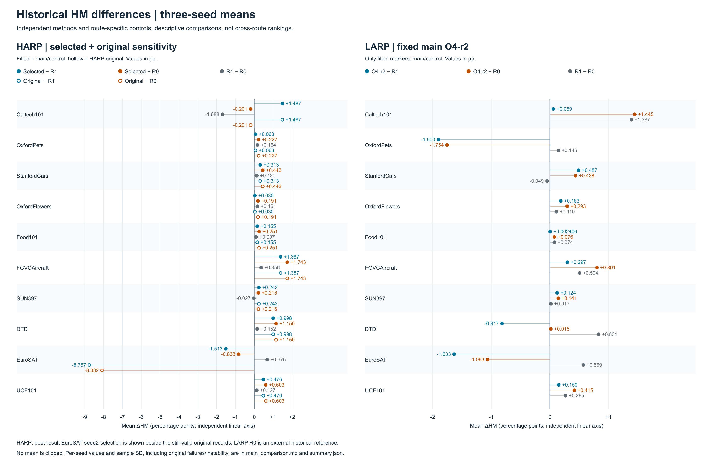

# 项目发现的问题、修正与实验结论

本页帮助使用者理解本项目为什么这样实现、实验回答了什么，以及不能从现有数据推断什么。数字来自随仓库提供的**既有完成实验记录**，不是本次 Git 整理重新训练的分数。完整十集三 seed 主表、逐 seed 成绩、结构消融与来源可分别查阅 [HARP 实验发现](HARP_FINDINGS.md)、[LARP 实验发现](LARP_FINDINGS.md)及[结果查询说明](../results/README.md)。三篇基础/参考论文的贡献与本项目采用范围见[引用与致谢](REFERENCES_AND_ACKNOWLEDGEMENTS.md)。

只想先了解我们做出了什么，可以先读[研究贡献](OUR_CONTRIBUTIONS.md)：两条视觉侧适配方案与收益条件分析是研究成果；基础框架、通用Adapter/LoRA和工程验收不冒充本项目原创。

## 1. 研究问题与实际改动

共同问题是：在固定教师的无标签提示蒸馏中，保留原视觉提示和语义投影器后，学生视觉侧新增少量参数能否改善 Base/Novel 的综合识别表现？本项目分别采用两种更新路径：

- **HARP**：最后四个视觉编码块中的非线性瓶颈残差；主宽度32，新增199,808参数，零输出起点，实际fix2反向及配套分组更新。
- **LARP**：最后四个视觉块的注意力输出投影O的低秩增量；主rank2，新增12,288参数，零增量起点，普通FP16 SGD更新。

它们独立运行，均使用原KD目标，不叠加RP或额外参考KL。前向、梯度、学习率和冻结范围的具体定义见[方法总览](METHODS_OVERVIEW.md)、[HARP实现](HARP_IMPLEMENTATION.md)和[LARP实现](LARP_IMPLEMENTATION.md)。完整配置的收益不能拆成未做单独对照的“某项规则必然有效”。

## 2. 发现的问题与处理边界

| 问题/观察 | 最终采用的处理 | 仍需注意 |
| --- | --- | --- |
| 仅关闭新增模块不能自动等同原基线 | 同时保留原框架复现R0和各路线匹配控制R1；分别报告方法−R1、方法−R0及R1−R0 | R0与R1的公共调度不同；R0不是新运行中的同机归因控制 |
| 注意力后端与重复计算可能影响数值核验 | 保留最终实跑后端：HARP memory-efficient attention关闭，LARP开启；两者benchmark均开启 | 两路线不声称数值等价；关闭某内核不是完全确定性的证明，也不能据原始分数直接排名路线 |
| 小残差与FP16反向规则必须说清 | HARP保留fix2指定VJP、原新增组暂缓/渐升与公共投影器渐升；代码和伪代码明确该更新方式 | 不能将其写成普通缩放函数的自动微分；尚无该规则每一组件的独立收益消融 |
| 低秩适配的位置与注意力算子接线不应混为一谈 | LARP最终对原MHA的O权重做参数化；冻结Q/K/V，不改写原注意力计算结构 | 旧V/Q或额外目标候选不等于当前主配置，不能拼接各候选的最好分数 |
| 初始化、输入或学习率不匹配会削弱归因 | 新入口登记共同初态、每角色四步工程检查、全batch输入/公共LR配对及首次独立重载；硬失败留存并停止 | 工程检查通过只说明满足核验条件，不证明识别收益；新运行仍须真实GPU验收 |
| 更低蒸馏损失不总是更高HM | 同时分析末轮KD、逐轮Base、选定best的Base/Novel/HM和种子差异 | 不生成不存在的逐轮Novel；末轮目标与best识别分数测量对象不同 |
| 作用层位/容量改变后，任务响应不同 | 固定主配置，另列既定位置、宽度、rank及层集合消融 | 不把消融高值事后换成主方法；rank与缩放、层数与参数量、部分节点条件有耦合 |
| 源码打包不等于全新环境已经复现 | 保存原科学源码/配置，新增便携入口、检查和来源文档；发布包离线验收 | 数据/权重需另备，公开教师文件身份及新Linux安装、完整CUDA流程尚待验收 |

具体历史问题与结果敏感性在各路线文档中集中说明，原始结果和失败不删除。这里不把所有退化都归因于工程错误，也不宣称所有数值问题已找出唯一根因。

## 3. 实验支持的结论

实验范围为十个数据集、seed1/2/3，每角色从原初始化训练20轮。HM先按每个seed的Base/Novel计算，再取三seed平均；差值单位是**百分点（pp）**，不是相对增长百分比。Base测试首次严格最高决定best；Novel与Base使用同一选定检查点，不按Novel或HM择高选epoch。[实验协议](EXPERIMENT_PROTOCOL.md)

**HARP有真实的任务收益。** 当前主报告口径下，十集三seed平均HM在九集上高于匹配R1，八集同时高于R0/R1；Aircraft和DTD的三seed均有Base、Novel与HM同步提高。位置和宽度消融提供任务依赖与容量取舍的证据，不支持“主宽度32在所有任务最优”。HARP宏均值的正收益受到既有重复记录选用影响，原口径与当前口径必须一起理解；原值和敏感性在[HARP文档](HARP_FINDINGS.md)及[原结果JSON](../results/harp/complete_results.json)保留。

**LARP有多任务正向覆盖，但没有十集宏平均优势。** 原O4/r2主实验在七集上同时高于R0/R1，Cars三个seed有两类准确率与HM同步提高，Flowers三个seed的Novel/HM均提高；与此同时，十集宏HM相对匹配R1下降0.3046pp。较多任务的小幅提高与少数任务的较大退化可以同时存在。rank和层集合消融不能把主r2改写为已测最优，也不能把微小正宏差写成普遍稳定优势。[LARP文档](LARP_FINDINGS.md)

项目原有“至少7/10同时高于R0/R1”的目标是方向性覆盖门槛，不是显著性检验。达到该门槛不自动说明宏均值、每个seed或每个指标都提高，也不是从同样本中调参后获得独立盲测优势的证明。

## 4. 可直接核查与重算

现成的全十集精确表和完整正负差值图在[主实验汇总表](../results/findings/main_comparison.md)、[三参照差值图](../results/findings/main_hm_deltas.svg)和[未舍入摘要](../results/findings/summary.json)。两路线各自使用匹配R1，不将两面板当成HARP/LARP的跨后端排名；图和表包含原/选用口径的范围说明。



图中差值以pp为单位、各面板使用独立线性轴；实心点显示主方法及控制的比较，HARP空心点补充原主序列。图展示均值而非误差区间，逐seed值与样本SD见同源表。这里不分配论文正式图号。[高清PNG](../results/findings/main_hm_deltas.png)、[可编辑SVG](../results/findings/main_hm_deltas.svg)

使用[离线分析工具](../tools/build_findings.py)可以由随包原JSON重算统计。默认只打印摘要；写出图表需要显式给出一个**不存在的新输出目录**：

```bash
python tools/build_findings.py --output-root /path/to/new_findings
```

该操作只读取既有JSON和生成派生统计/静态图，不下载物料、不导入模型、不训练或重评。生成记录包含来源SHA，原结果不修改。新训练结果应使用[summarize_run.py](../tools/summarize_run.py)，不能以仓库历史结果充当本次新运行的成绩。

分析工具用Python标准库生成SVG，运行不需要绘图库。随仓库PNG由同一SVG以144 dpi栅格化（3400×2240），不另算数据；PNG是阅读副本，SVG、JSON和脚本用于重算与核查。

## 5. 现有证据不支持的说法

不能据此宣称所有数据集/种子稳定提升、已证明每项优化规则的独立贡献、优于所有视觉语言适配方法、具备零额外推理时延，或已在任意机器复现完全相同的准确率。专门训练/推理效率、永久权重合并、完整新环境CUDA复现及新的独立测试协议尚未完成；缺项不以理论参数计数或合成测试补充成实测结论。

项目的研究价值是明确实现两种可追溯的视觉侧更新方式，并通过真实主比较、结构对照和训练记录揭示收益及其适用条件，而不是把局部涨分或工程验收包装成普适性能保证。
